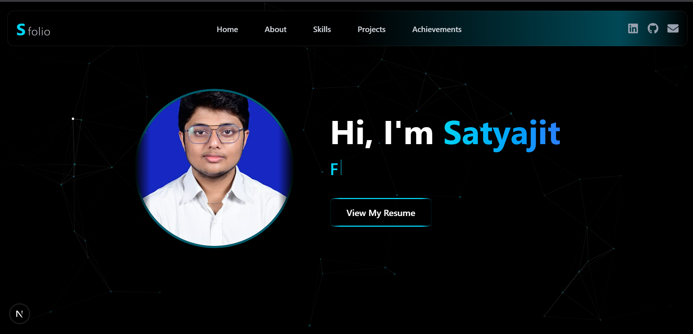

# 🚀 Satyajit Pradhan — Frontend Developer Portfolio

A modern, responsive personal portfolio built with **Next.js**, **React**, and **Tailwind CSS** — designed to clearly communicate my skills, projects, and approach to frontend development.

> 💡 Built with a focus on **performance**, **clean component architecture**, and **accessibility-aware UI**.

🔗 **[Live Demo](https://w9m7frw7-3000.inc1.devtunnels.ms/)** · 📄 **[Resume](https://drive.google.com/file/d/18gkDPHbsfHROZwXHhzzwNkm1frAI5PME/view?usp=drive_link)** · 💼 **[LinkedIn](https://www.linkedin.com/in/satyajit-pradhan-06093525b/)**

---

## 📸 Preview



---

## 🛠️ Tech Stack

| Technology | Purpose |
|---|---|
| React.js | Component-based UI architecture |
| Next.js | Routing, performance & SSR |
| Tailwind CSS | Responsive, utility-first styling |
| JavaScript (ES6+) | Core logic & interactivity |
| HTML5 & CSS3 | Semantic markup & base styles |

---

## ✨ Features

- ⚡ **Optimised performance** — fast load times with Next.js
- 📱 **Fully responsive** — works across all screen sizes
- 🎯 **Interactive UI** — custom Cursor Trail & Particle Background
- 📄 **Resume download** — one-click access for recruiters
- ♿ **Accessibility-conscious** — semantic HTML & readable contrast

---

## 🗂️ Sections

| Section | Description |
|---|---|
| Hero | Introduction & call-to-action |
| About | Background & developer philosophy |
| Skills | Technologies I work with |
| Projects | Real-world builds with links |
| Achievements | Milestones & recognitions |

---

## ⚙️ Getting Started

```bash
# Clone the repository
git clone https://github.com/Satyajit7822/PPortfolio

# Navigate into the project
cd PPortfolio

# Install dependencies
npm install

# Run the development server
npm run dev
```

Open [http://localhost:3000](https://w9m7frw7-3000.inc1.devtunnels.ms/) in your browser.

---

## 🙋‍♂️ About Me

Hi, I'm **Satyajit Pradhan** — a frontend developer with a focus on building **fast, accessible, and well-documented** web experiences.

- 🎓 B.Tech Student
- ⚛️ Specialising in React & modern JS frameworks
- 📝 Strong believer in clean documentation and readable code
- 🎯 Currently seeking a **junior frontend role**

---

## 📬 Let's Connect

- 📧 Email: [pradhansatyajit182@gmail.com](mailto:pradhansatyajit182@gmail.com)
- 💼 LinkedIn: [satyajit-pradhan](https://www.linkedin.com/in/satyajit-pradhan-06093525b/)
- 💻 GitHub: [@Satyajit7822](https://github.com/Satyajit7822)

---

> _"Good frontend isn't just about making things look nice — it's about making them work for everyone."_
